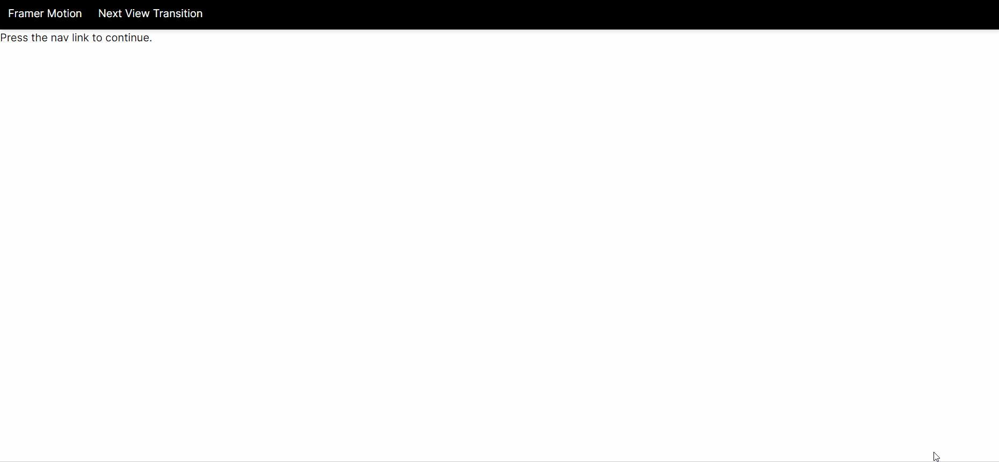

# Quick demo to compare framer-motion and next-view-transitions
This is just a quick demo compare page transition in next.js app router.
## Implementations
### Framer-motion
The basic implementation to apply page transition animation is:
1. Crate a new compoent in root or route folder named template.tsx.
2. Simply add animation and it will works.
### next-view-transition
1. Use the ```ViewTransitions``` component to wrap the layout.
2. Use the ```Link``` component to navigate to another page instead of default ```Link``` component.
## Problem
But it comes out a problem during the page transition using framer-motion, \
even I add the exit animation, the exit anitmation will not work in app router as below.

## Further discussion
See the discussion on: https://github.com/vercel/next.js/issues/49279